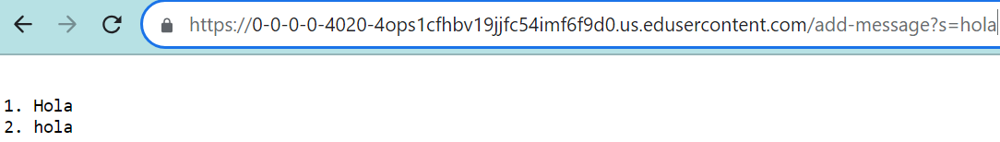
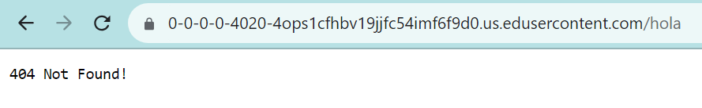

## Part 1
Code for my StringServer. It is in the wavelet folder from week2.
```
import java.io.IOException;
import java.net.URI;

class Handler implements URLHandler {
    String display = ("");
    int counter = 1;

    public String handleRequest(URI url) {
        
            if (url.getPath().contains("/add-message")) {
                String[] parameters = url.getQuery().split("=");
                if (parameters[0].equals("s")) {
                    display = display + "\n" + counter + ". " + (parameters[1]);
                    counter++;
                    return display;
                }
            }
            return "404 Not Found!";
        
    }
}

class StringServer {
    public static void main(String[] args) throws IOException {
        if(args.length == 0){
            System.out.println("Missing port number! Try any number between 1024 to 49151");
            return;
        }

        int port = Integer.parseInt(args[0]);

        Server.start(port, new Handler());
    }
}
```


Screenshot 1: is a success, adds messages to the list in the expected format.
This calls the handleRequest method, and reads the lines inside both if statements because they are true.
This increments the counter and adds to the String display, which are permanently altered for the url created.

Screenshot 2: not a success, returns error not found message.
This calls the handleRequest method, but skips the if statement because it doesn't find /add-method in the url.
This does not increment the counter or change the String display
## Part 2
