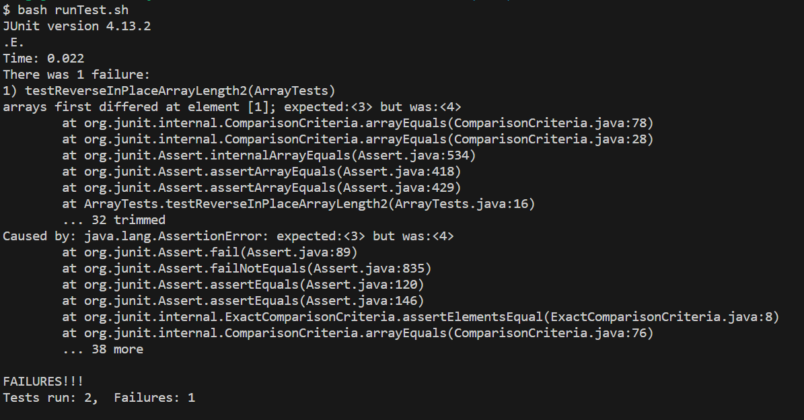

## Part 1
Failure-inducing test:
```
@Test 
	public void testReverseInPlaceArrayLength2() {
    int[] input1 = { 3, 4 };
    ArrayExamples.reverseInPlace(input1);
    assertArrayEquals(new int[]{ 4, 3 }, input1);
	}
```
Non-failure test:
```
@Test 
	public void testReverseInPlace() {
    int[] input1 = { 3 };
    ArrayExamples.reverseInPlace(input1);
    assertArrayEquals(new int[]{ 3 }, input1);
	}
```
Symptom:

Code with bug:
```
static void reverseInPlace(int[] arr) {
    for(int i = 0; i < arr.length; i += 1) {
      arr[i] = arr[arr.length - i - 1];
    }
  }
```
Code without bug:
```
static void reverseInPlace(int[] arr) {
    for(int i = 0; i < arr.length/2; i += 1) {
      int placeHolder = arr[i];
      arr[i] = arr[arr.length - i - 1];
      arr[arr.length - i - 1] = placeHolder;
    }
  }
```
The issue in the original(buggy) code is that, when trying to replace the second half of the array with the first half,
the first half has already been replaced by the second half, and the original values of the first half were not saved
anywhere to be accessible when setting the second half of array.
## Part 2
-iname searches for files with an approximate name(ie files containing the provided name or with different capitalization)
```
find technical/ -iname "*2001*txt"
technical/biomed/gb-2001-2-10-research0041.txt
technical/biomed/gb-2001-2-10-research0042.txt
//removed some middle lines, output was lengthy
technical/plos/pmed.0020018.txt
technical/plos/pmed.0020019.txt
```
This example helped locate all filed dated 2001 within the file name, as well as files with 2001 elsewhere in the name. This is useful because I did not have to list out all desired files or know the entire name.
```
find technical/biomed -iname "*2002*txt"
technical/biomed/gb-2002-3-10-research0052.txt
technical/biomed/gb-2002-3-10-research0053.txt
//removed some middle lines. output was lengthy
technical/biomed/gb-2002-4-1-r1.txt
technical/biomed/gb-2002-4-1-r2.txt
```
This example helped locate all files written in 2002. It could help narrow down the search for a specific wile when only some information is known about it, or display all files with a certain tag in the name to make them findeable by -iname\
This command is useful because it can return all files about the same thing, or can help locate a specific file without being case sensitive.<br>

-maxdepth returns only the files within a specified depth within the directory.
```
find technical/ -maxdepth 1
technical/
technical/911report
technical/biomed
technical/government
technical/plos
```
In this example I am able to see all the directories in technical without the additional clutter of the many files in each folder.
```
find technical/government -maxdepth 2
technical/government
technical/government/About_LSC
technical/government/About_LSC/Comments_on_semiannual.txt
//output was many lines long, I removed the middle lines
technical/government/Post_Rate_Comm/ReportToCongress2002WEB.txt
technical/government/Post_Rate_Comm/WolakSpeech_usps.txt
```
With maxdepth, I can set the depth so that I still see the files inside the folders. This example displayed all the files in government.<br>
This command is useful because, unlike using find on its own to display the paths, you can control the depth of the paths you want to see.<br>

-empty returns the files that are empty
```
find technical/ -empty

```
This example shows confirmation that there are no empty files. It could help declutter the directory if I did have empty files.<br>
currently there are no empty files. I have added one to see the result for the second example of -empty
```
find technical/ -empty
technical/911report/emptyTest.txt
```
This example shows the display when the directory has an empty file. I now have it's name in case I lost track of a new file or want to delete the empty ones.<br>
This command is useful because it locates by contents rather than by name. It also might help if you've just created a file but lost track of it before opening it.

-ipath finds a file by the end of its path.
```
find technical/ -ipath "*About_LSC/Comments_on_semiannual.txt"
technical/government/About_LSC/Comments_on_semiannual.txt
```
I now have the full path for this file, in case I did not know the folder it was in.
```
find technical/ -ipath "*Alcohol_Problems/Session2-PDF.txt"
technical/government/Alcohol_Problems/Session2-PDF.txt
```
This example helped me locate a specific file in technical, without knowing that it was in /government.<br>
This command is usefule because it allows you to find files without needing to know the entire path, but is a specific enough search that the output is not long. <br>
I used the same source to find all commands. Here is the link: 
[Source](https://www.redhat.com/sysadmin/linux-find-command)
