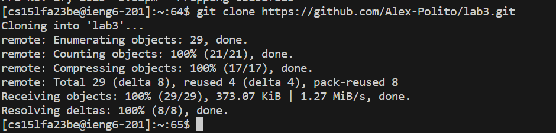

Step 4: <br>
Keypresses: 
```
ssh<space>cs15lfa23be@ieng6.ucsd.edu<enter>
```
 <br>
Step 5: <br>
Keypresses: 
```
git<space>clone<space><ctrl>v<enter> //I copied the url to clone from my github page before this step
```
 <br>
Step 6: <br>
Keypresses: 
```
cd<space>lab7<enter>bash<space>test.sh<enter>
```
 <br>
Step 7: <br>
Keypresses: 
```
vim<space><shift>list<shift>examples.java<enter> //to open up vim editor
i<down(x43)><right(x12)><backspace>2<esc><shift>;wq<enter>
```
 <br>
 <br>
Step 8: <br>
Keypresses: 
```
<up><up><enter> //command was run two commands previous, so I used keyboard shortcut <up> to retrieve it
```
 <br>
Step 9: <br>
Keypresses:add commit summary. Click commit. click push.

